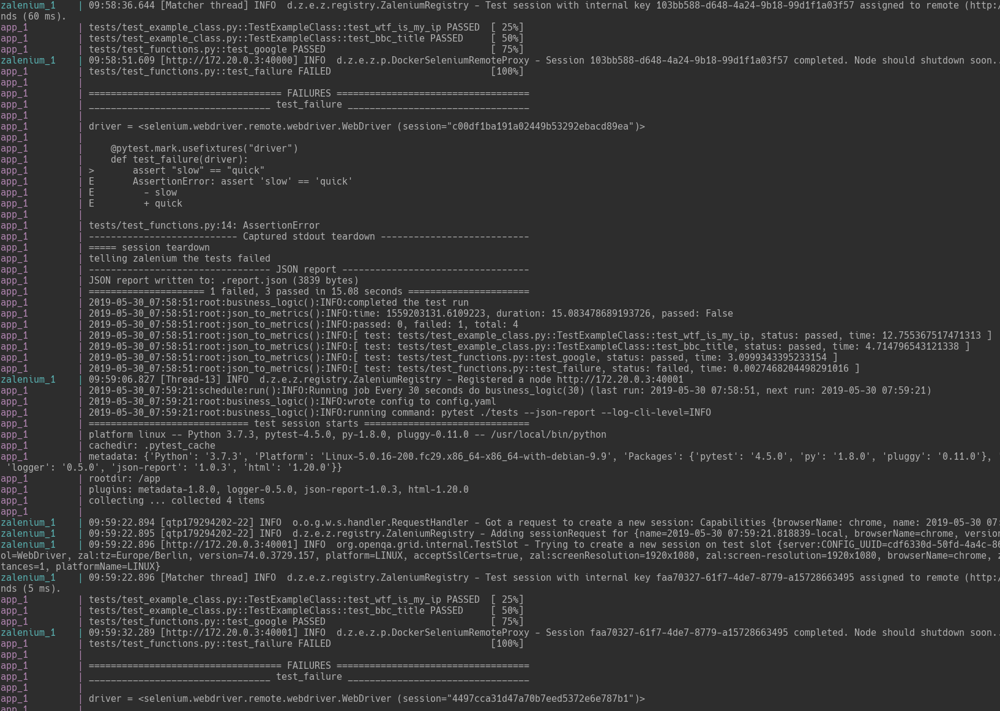
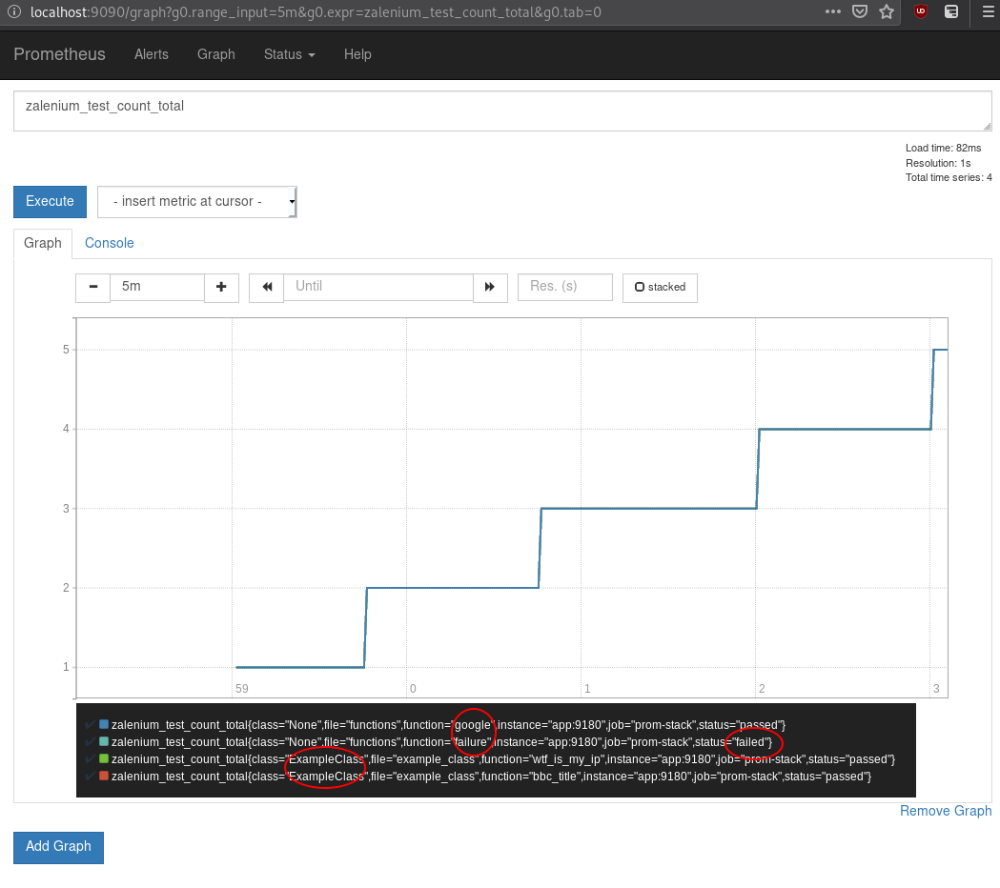
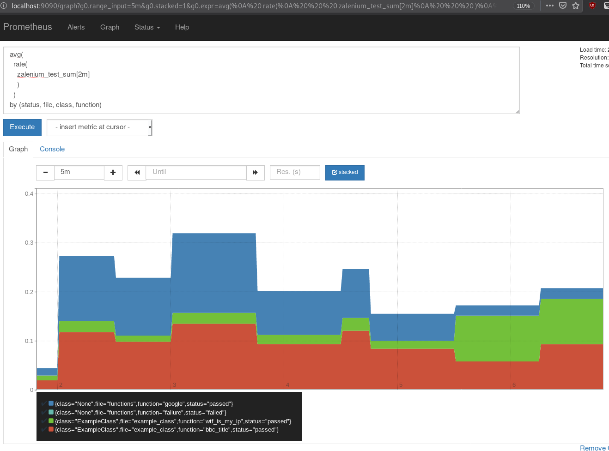
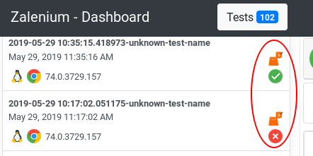

# running this locally

there is a `docker-compose.yml` including:
- `app` which is this code.. see `Dockerfile`
- prometheus (configured to scan the `app`) and let you play with the data.. See: http://localhost:90980/graph
- zalenium.. see: http://localhost:4444/grid/admin/live and http://localhost:4444/dashboard/

`docker-compose up --build`


## screenshots


Produces metrics a little like:
```
➜ curl -s localhost:9180| sort | grep ^zale
zalenium_session_count 11.0
zalenium_session_created 1.5592030847380915e+09
zalenium_session_sum 212.16610550880432
zalenium_test_count{class="ExampleClass",file="example_class",function="bbc_title",status="passed"} 11.0
zalenium_test_count{class="ExampleClass",file="example_class",function="wtf_is_my_ip",status="passed"} 11.0
zalenium_test_count{class="None",file="functions",function="failure",status="failed"} 11.0
zalenium_test_count{class="None",file="functions",function="google",status="passed"} 11.0
zalenium_test_count_created{class="ExampleClass",file="example_class",function="bbc_title",status="passed"} 1.55920313178635e+09
zalenium_test_count_created{class="ExampleClass",file="example_class",function="wtf_is_my_ip",status="passed"} 1.5592031317855785e+09
zalenium_test_count_created{class="None",file="functions",function="failure",status="failed"} 1.5592031317875257e+09
zalenium_test_count_created{class="None",file="functions",function="google",status="passed"} 1.559203131786896e+09
zalenium_test_count_total{class="ExampleClass",file="example_class",function="bbc_title",status="passed"} 11.0
zalenium_test_count_total{class="ExampleClass",file="example_class",function="wtf_is_my_ip",status="passed"} 11.0
zalenium_test_count_total{class="None",file="functions",function="failure",status="failed"} 11.0
zalenium_test_count_total{class="None",file="functions",function="google",status="passed"} 11.0
zalenium_test_created{class="ExampleClass",file="example_class",function="bbc_title",status="passed"} 1.5592031317864344e+09
zalenium_test_created{class="ExampleClass",file="example_class",function="wtf_is_my_ip",status="passed"} 1.559203131785729e+09
zalenium_test_created{class="None",file="functions",function="failure",status="failed"} 1.5592031317876172e+09
zalenium_test_created{class="None",file="functions",function="google",status="passed"} 1.5592031317870023e+09
zalenium_test_sum{class="ExampleClass",file="example_class",function="bbc_title",status="passed"} 49.383102893829346
zalenium_test_sum{class="ExampleClass",file="example_class",function="wtf_is_my_ip",status="passed"} 18.19291377067566
zalenium_test_sum{class="None",file="functions",function="failure",status="failed"} 0.013609170913696289
zalenium_test_sum{class="None",file="functions",function="google",status="passed"} 34.488142013549805
```

I'm still playing with different types of counters/gauges but here are some examples





# Purpose

This repo can act as a template/implementation example for any DevOps/SREs out there who would like to:
- be able to quickly build up a suite of tests for their website (EG: can I login, can I buy something.. etc)
- tests are done via selenium but as this is python you can extend to using many other tools
- produce prometheus metrics from those selenium tests
- drive promotions or Flagger-like canary deploys from those metrics
- see and example of how to make a tests framework play well with zalenium.. EG: this code marks the zalenium build status Failed/Success

TODO:
- generate html report
- example report upload to gcs/s3
- create an example of a slack alert (including a link to the zalenium tests URL + html report)


## Tooling

There are several parts to this.. they are:

### pytest
pytest is a well documented and large eco-system of testing utilities for python. Traditionally its included with code and used for doing stuff like unit tests etc.

In this case I'm using it to:

- allow a user to add new "tests" and easily control their dependancies and ordering
- extend the tests with fixtures, tags etc

I'm not going to go into much detail on how it works but within this repo its pretty simple

### adding a test
1. inside the `tests` folder..  either create a file starting with `test_` or extend an existing file.
2. Either create a class with the prefix `Test` and or a function starting with `test_`
3. "do stuff" in there.. then `assert` something to run the test
4. See the existing examples and use the same decorator to get access to the selenium `fixture`


### zalenium
> TLDR: Like Selenium but by Zalando and with some nice "cloud" features

See `conftest.py` where a `driver` function is created.. This is a `fixture` which pytest will use.
Basically it deals with setting up a zalenium browser which is scoped to the whole "pytest session"..
It also tears down the browser, marks the status as failed/success on the zalenium backend also.

For example




